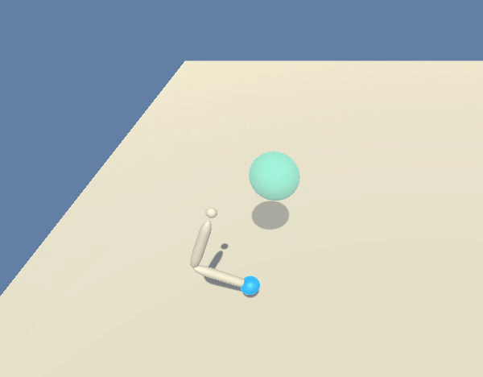
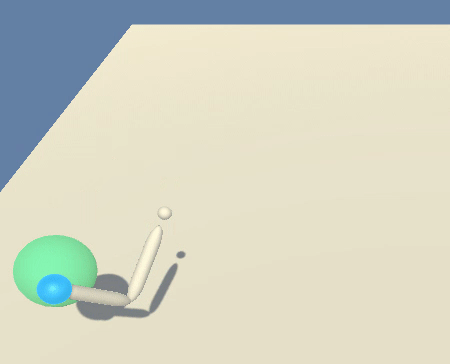

# Project 2: Continuous Control

| Agent with untrained random actions | Trained Agent | 
|--------------------------------------|--------------------------------------|
|  |  | 

## Introduction

This project includes a training approach for the Unity [Reacher](https://github.com/Unity-Technologies/ml-agents/blob/master/docs/Learning-Environment-Examples.md#reacher) environment.

In this environment, a double-jointed arm can move to target locations. A reward of +0.1 is provided for each step that the agent's hand is in the goal location. Therefore it's the goal to **maintain the arm as long as possible in the desired goal location**.

The observation space consists of 33 variables corresponding to position, rotation, velocity, and angular velocities of the arm. Each action is a vector with four numbers, corresponding to torque applicable to two joints. Every entry in the action vector should be a number between -1 and 1.

## Goal

The goal is to train the robotic arm to stay as long in the goal location until a reward of +30 over 100 consecutive episodes is reached. It will be trained using a Deep Deterministic Policy Gradient (DDPG) algorithm with a single agent.

The training will be done in a headless python environment instead of a jupyter notebook as it will take several hours.

## Included important files

  * `run_trained_ddpg_models.ipynb`: Compare visually a random action DDPG-Agent with a trained Agent using Unity environment with visual frontend -> [Linux Environment](https://s3-us-west-1.amazonaws.com/udacity-drlnd/P2/Reacher/one_agent/Reacher_Linux.zip)
  * `train_ddpg_headless.py`: Training script to run on a headless server with non visual Unity environment -> [Linux Headless Environment](https://s3-us-west-1.amazonaws.com/udacity-drlnd/P2/Reacher/one_agent/Reacher_Linux_NoVis.zip)
  * `ddpg_agent.py`: includes the class for the agent, that initialises the models and acts and learns (with the initialised models) against the given Unity environment
  * `model.py`: has the Pytorch-based architectures for the Actor and Critic
  * `checkpoint_actor.pth` and `checkpoint_critic.pth`: the checkpoint weights for the models that reached a consecutive reward of +30 over 100 episodes
  * `last_scores.txt`: list of numbers which represents the reward development over all training episodes
  

## Installation

### Unity Environment

1. Download the environment from one of the links below.  You need only select the environment that matches your operating system:

    - **_Version 1: One (1) Agent_**
        - Linux: [click here](https://s3-us-west-1.amazonaws.com/udacity-drlnd/P2/Reacher/one_agent/Reacher_Linux.zip)
        - Linux (Headless) [click here](https://s3-us-west-1.amazonaws.com/udacity-drlnd/P2/Reacher/one_agent/Reacher_Linux_NoVis.zip)
        - Mac OSX: [click here](https://s3-us-west-1.amazonaws.com/udacity-drlnd/P2/Reacher/one_agent/Reacher.app.zip)
        - Windows (32-bit): [click here](https://s3-us-west-1.amazonaws.com/udacity-drlnd/P2/Reacher/one_agent/Reacher_Windows_x86.zip)
        - Windows (64-bit): [click here](https://s3-us-west-1.amazonaws.com/udacity-drlnd/P2/Reacher/one_agent/Reacher_Windows_x86_64.zip)

2. Place the included binary file that ends with `x.86_64` (as I'm using 64-bit OS) in a location that is reachable from your training code. 

3. This unity environment can only be run with a Python Version `>= 3.6`.

### Python Environment

1. Install a Python 3.6 Environment on your host (the Unity Environment will only work with Python 3.6)
2. Create a virtual environment:`virtualenv -p /usr/bin/python3.6 your_environment` and activate it `source your_environment/bin/activate`
3. (When in activated virtual environment) Install the necessary packages from the requirements in this repo: `pip install -r requirements.txt`  

