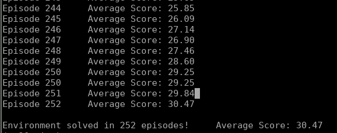
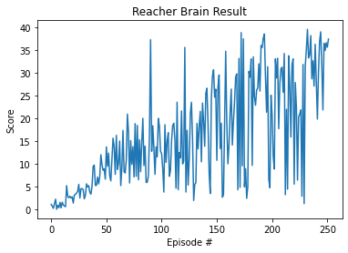

# Training Specs

I used the Reacher Unity Environment leveraging only **one training agent**. As the training process took several hours it was much more handy for me to run the training in a headless environment via a python script instead a jupyter notebook.
The hyperparameters where choosen with some assumptions but in the end the best results where found by trying different combinations:

```
##Reacher Environment##

# Environment Details
- Number of Agents: 1
- Size of Action (Continuous): 4 
- Number of state variables: 33

# Hyper Parameters
{'batch_size': 256,
 'buffer_size': 100000,
 'gamma': 0.99,
 'lin_full_con_01': 128,
 'lin_full_con_02': 128,
 'lr_actor': 0.001,
 'lr_critic': 0.001,
 'noise_scalar': 0.25,
 'tau': 0.001,
 'weight_decay': 0}
```

  * The training was done with a `Intel(R) Xeon(R) CPU E5-2630 v4 @ 2.20GHz` in a headless VPS Machine.
  * It took about 6 hours and 252 episodes to finish the training successfully:
  




# Important Parts

I've used the [ddpg-pendulum](https://github.com/udacity/deep-reinforcement-learning/tree/master/ddpg-pendulum) example as the basis for my implementation. The biggest part of this example is used without further modification.

## DDPG Algorithm

The Deep Deterministic Policy Gradient (DDPG) is a Off-Policy-Algorithm which leverages Q-Learning to learn an optimal policy. A DDPG is composed of two networks : one actor and one critic. The actor can be seen as the Policy Network and the critic as the Value network. Both are used together to calculate the next-state Q-Values and the critic will try minimize the loss between the updated and the original Q value. With this information the actor will try to maxize the expected return by optimizing the policy.
Both elements have additional target networks, which can be seen as time-delayed representations of the actor/critic local network. Isolate the local and the target and soft updating the target networks helps in improving learning performance and preventing divergence.
For applying actual deep learning, we need some kind of Buffer, from with training data can be sampled. This is done using a Replay Buffer.
To assist the exploration of the agent an additional noise component is introduced that can be quite complex, to have the right amount of "disturbance". (I used a single static value instead, see below)

The training and learning is happening in steps over the episodes happening in the environment.
Initially, when starting:
  * the actor and critic networks are initialised with random weights
  *  he Replay Buffer gets initialised
For the beginning of every episode:
  * the noise process gets initialised for a fresh start
During each step of a episode:
  * according to the current policy an action is executed, the reward and and the next state gets collected
  * each step we are storing actions and states into the Replay Buffer and take a sample from it
  * this sample is used to update the critic by minimizing the loss between original and updated Q-Values
  * and updating the actor by applying Gradient Ascent to the sampled policy gradient
  * in the end of the step the target networks gets updated


## Model

### Modifications

The used model architecture corresponds with the pendulum example and an additional layer for Batch Normalization after the ReLu-Activation of the first Linear Layer. I tried several locations for the Batch Normalization layer. Especially the topic of whether placing the Batch Normalization before or after an ReLu activation is subject of many discussions like this one: https://forums.fast.ai/t/why-perform-batch-norm-before-relu-and-not-after/81293/4

After checking both alternatives, the Batch Normalization before ReLu-Activation shows much better results.
In combination with the BATCH_SIZE of 256 the learning had it's best performance with a lenght of 128 for both fully connected linear layers in the Actor and Critic Model.


## DDPG Agent and Replay Buffer

### Modifications

The used implementation of the DDPG agent corresponds also strongly with the pendulum example. I changed one important thing, I removed the `OUNoise` completely and replaced it with a static value for the noise function. I found the great article https://soeren-kirchner.medium.com/deep-deterministic-policy-gradient-ddpg-with-and-without-ornstein-uhlenbeck-process-e6d272adfc3 from another student of this course. He experimented with different sources and distributions of noise and came to the conclusion that in the case of the Reacher environment a static noise value works nearly as good as the Ornstein-Uhlenbeck Noise generator.
To reduce the number of influencing variables, I tried to train my DDPG using a static scalar, like Soeren did and got a faster Training Process, than with the `OUNoise before`.

# Future Work

## Influence of the Noise Process

  * Like the Student Soeren discovered, the Noise process has a significant impact on the learning performance. It seems, that static values, time-dependent or distance-dependent noise processes are feasible alternatives to optimize the exploring of the agent. I'm pretty sure, this can be optimized further and can increase the learning performance and the agent stability.
  
## Multi-Agent Training

 * Using multiple agents can dramatically decrease the necessary training time. How the agents are orchestrated in the episodes, how their values gets collected and the networks updated can play a huge role for training performance.
 
## Prioritized Replay

  * Right now our Replay Buffer doesn't any selection of very good training episodes. Like seen in this course before, Prioritized Replay could be applied to increase the training performance.

